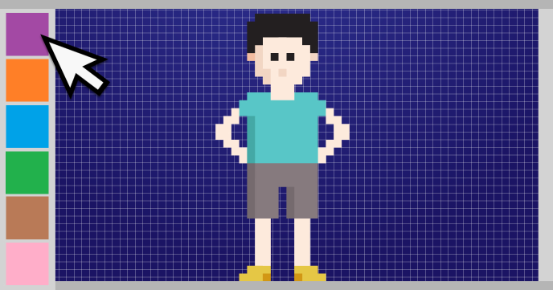

Pixel art is awesome. This tutorial will show you how easy is to build a simple pixel art editor. “Color Blocky” program adds color selection and other features to the more basic pixel art editor “Blocky” also presented on CodeGuppy.

Kids as well as nostalgic adults will have tons of fun playing with “Color Blocky”.

Feel free to further extend this editor with more tools and then share your new program with your family and friends.
 
## Source code 
The JavaScript source code of this program can be found [here](sketches/program.js). To run it, you need to import it in the [codeguppy.com](https://codeguppy.com) online editor. Alternatively, you can use the source code in your p5.js sketches (advanced use). 
## Online version 
To see the code running, check the online playground at [https://codeguppy.com/code.html?t=color_blocky](https://codeguppy.com/code.html?t=color_blocky) 
## Next steps 
Please check [codeguppy.com](https://codeguppy.com) for many other fun JavaScript programs and games for beginners. To stay up to date with CodeGuppy development please follow [@codeguppy](https://twitter.com/codeguppy) on Twitter.  
